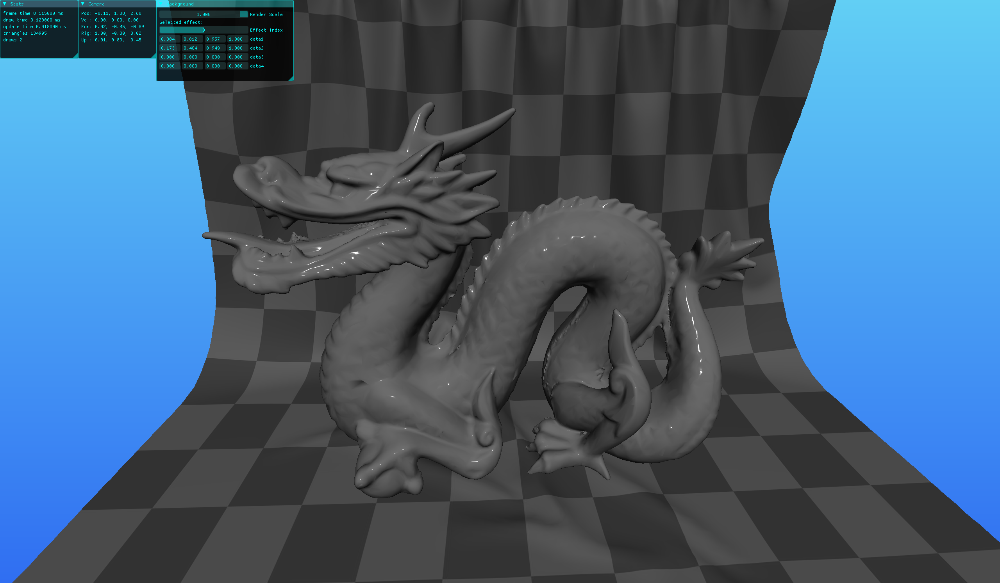
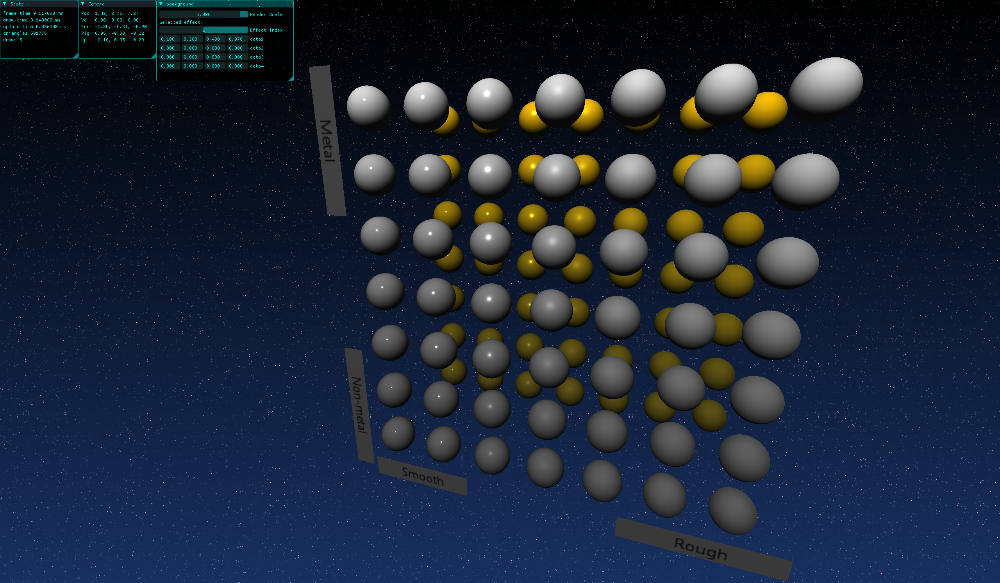

# GPBR
GPBR is a small rendering engine I created while learning the Vulkan API and physically based rendering techniques. I am slowly transforming this renderer into a feature-rich game engine, with a focus on optimization and stability.

I started this project using https://vkguide.dev/ and https://vulkan-tutorial.com/. These tutorials are excellent resources for anyone learning the API for the first time.

## Build Dependencies
### Windows/Linux
- Vulkan SDK 1.3.296+
- CMake 3.28+

If you are not using Windows: check if your Vulkan SDK includes Vulkan Memory Allocator (VMA) and Volk. You may need to alter the CMake configuration to include them.

## Screenshots

## Current Features
- Dear ImGui integration
- Bindless textures
- glTF 2.0 scene loading
- Basic PBR support (metallic-roughness mapping)
- Lighting (point + directional)
- Frustum culling

## Controls
- Mouse - Rotate camera
- WASD - Move forward/left/back/right
- Escape - Show/hide cursor